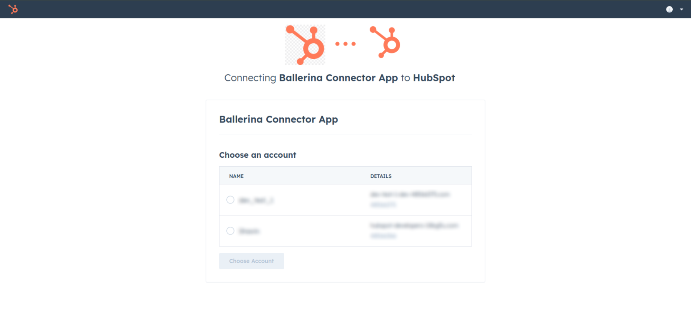

## Overview

[HubSpot](https://www.hubspot.com) is an AI-powered customer relationship management (CRM) platform. 

The ballerinax/module-ballerinax-hubspot.crm.obj.contacts offers APIs to connect and interact with the [Contact API](https://api.hubapi.com/crm/v3/objects/contacts) endpoints, specifically based on the [API Docs](https://developers.hubspot.com/docs/reference/api/crm/objects/contacts)

## Setup guide

To use the HubSpot connector, you must have access to the HubSpot API through a [HubSpot developer account](https://developers.hubspot.com/get-started) and a project under it. If you do not have a HubSpot Developer account, you can sign up for one [here](https://app.hubspot.com/signup-hubspot/developers?_ga=2.207749649.2047916093.1734412948-232493525.1734412948&step=landing_page).

### Step 1: Create a HubSpot Developer Project

1. Open the [HubSpot Developer Portal](https://app.hubspot.com/login/?loginRedirectUrl=https%3A%2F%2Fapp.hubspot.com%2Fsignup-hubspot%2Fdevelopers%3F_ga%3D2.269102326.624948025.1734413225-1764281074.1734413225%26step%3Dlanding_page)

2. Click on the 'App' tab and select an existing project or create a new project for which you want API keys and Authentication Access. 


In order to create a new poject, you must provide a public app name and a redirect url/s. Optionally you can add a app logo and a description for the app.


To add redirect url/s for the app, click the 'Auth' tab on top of the page, and navigate to 'Redirect URLs' section.


### Setp 2. Obtain Client ID and Client Secret.

1. After completing the project setup, you will be provided with your client id and client secret.  Make sure to save the provided client id and client secret.


### 2. Setup OAuth 2.0 Flow

Before proceeding with Quick start, ensure you ave obtained the Access Token and refresh Token using the following steps:

1. Add necessaryscopes for your app based on API your using. Go to the relevate [API reference](https://developers.hubspot.com/beta-docs/reference/api),  select the API  you have  and go through the operation.

You will see the scope has defined below way


2. Obtained the authorization URL (Install URL) from the Auth Section under 'Sample install URL (OAuth)' section.  It will be in this format:

```
https://app.hubspot.com/oauth/authorize?client_id=<client_id>&redirect_uri=<redirect_url>&scope=<scopes>
```
3. Copy and paste the generated URL into your browser. This will redirect you to the HubSpot authorization page.



4. Once you authorize, you will be redirected to your specified redirect URI with an authorization code in the URL.

**Note**: Store the authorization code and use it promptly as it expires quickly.

5. Use the obtained authorization code to run the following curl command, replacing <your_client_id>, <your_redirect_url>, and <your_authorization_code> with your specific values:

 - Linux/MacOS:
```bash
curl --request POST \
  --url https://api.hubapi.com/oauth/v1/token \
  --header 'content-type: application/x-www-form-urlencoded' \
  --data 'grant_type=authorization_code&code=<your_authorization_code>&redirect_uri=<your_redirect_url>&client_id=<your_client_id>&client_secret=<your_client_secret>'
```

 - Windows:
 ```bash
 curl --request POST \
  --url https://api.hubapi.com/oauth/v1/token ^
  --header 'content-type: application/x-www-form-urlencoded' ^
  --data 'grant_type=authorization_code&code=<your_authorization_code>&redirect_uri=<your_redirect_url>&client_id=<your_client_id>&client_secret=<your_client_secret>'
 ```

 This command will return the access token and refresh token necessary for API calls.

 ```json
{
  "token_type": "bearer",
  "refresh_token": "xxxxxxxxxxxxxxxxxxxxxxxxxxxxxxx",
  "access_token": "xxxxxxxxxxxxxxxxxxxxxxxxxxxxxxxxxxxxxxxxxxx",
  "expires_in": 1800
}
 ```

 6. Store the access token securely for use in your application.

## Quickstart

To use the `HubSpot CRM Contact Connector` connector in your Ballerina application, update the `.bal` file as follows:

### Step 1: Import the module

Import the `hubspot.crm.obj.contact` module.

````java
import ballerinax/hubspot.crm.obj.contact;
````

### Step 2: Instantiate a new connector

1. Create a `OAuth2RefreshTokenGrantConfig` with the obtained access token and initialize the connector with it.

````ballerina
configurable OAuth2RefreshTokenGrantConfig & readonly auth = ?;

final contact:Client contactClient = check new ({ auth });
````

2. Create a Config.toml file and, configure the obtained credentials in the above steps as follows:

````toml
[auth]
clientId = "<Client Id>"
clientSecret =  "<Client Secret>"
refreshToken = "<Refresh Token>"
credentialBearer =  "POST_BODY_BEARER"
````

### Step 3: Invoke the connector operation

Now, utilize the available connector operations.

**Create a contact**

```ballerina
contact:SimplePublicObjectInputForCreate newContact = {
    associations: [
        {
            to: {
                id: "associated_id"
            }
        }
    ],
    objectWriteTraceId: "object_write_trace_id",
    properties: {
        "sample_property": "sample_value"
    }
};

contact:SimplePublicObject response = check contactClient->/.post(newContact);
```

**List contacts**

```ballerina
contact:CollectionResponseSimplePublicObjectWithAssociationsForwardPaging contacts = check contactClient->/.get();
```

### Step 4: Run the Ballerina application

````bash
bal run
````


## Examples

The `Ballerina HubSpot CRM Contacts Connector` connector provides practical examples illustrating usage in various scenarios. Explore these [examples](https://github.com/module-ballerinax-hubspot.crm.object.contacts/tree/main/examples/), covering the following use cases:
